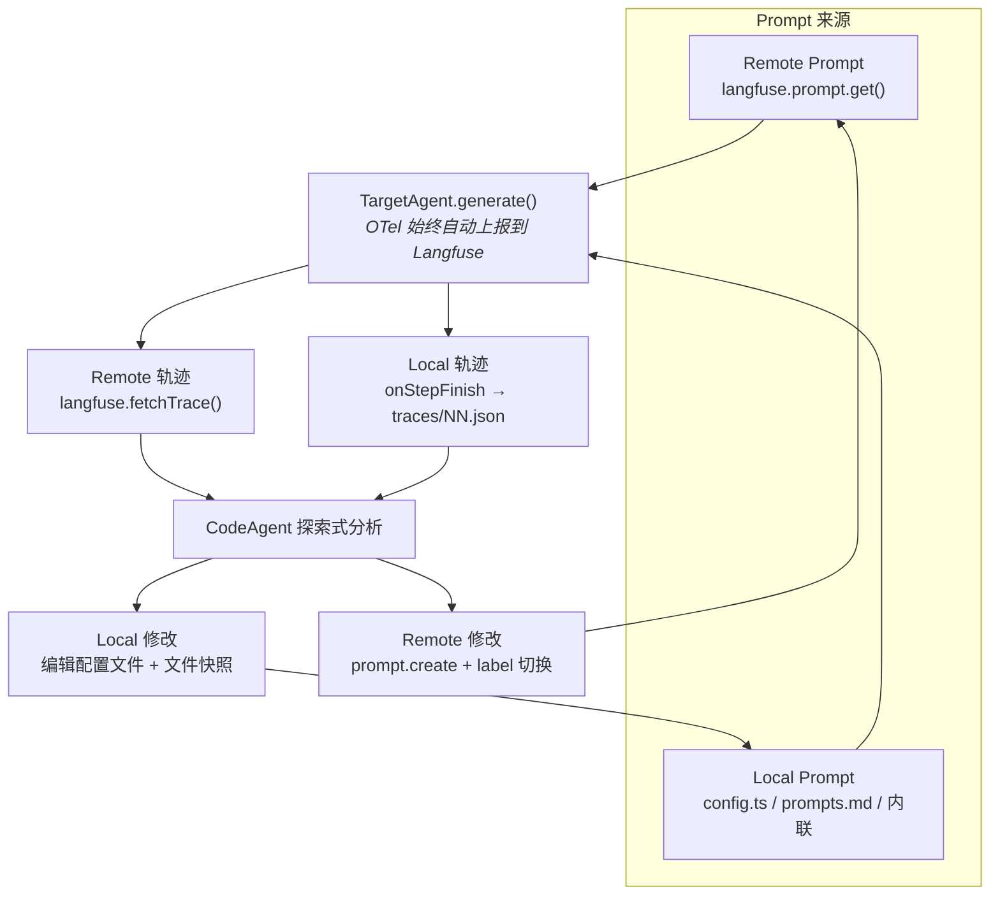

# agent-tuning 设计方案

## 设计目标

通过自动化的「调用 → 轨迹分析 → 内省 → 配置修改」循环，系统化地优化 TargetAgent 的行为配置，替代人工反复试错。

约束：
- 调优对象限于进程内模型调用，不支持外部 API 服务。
- 每轮修改最小化（单一变更原则），确保可归因。
- 不修改模型本身，仅调整配置（系统提示词、工具描述、few-shot 示例）。

非目标：
- 不做模型选型（能力不足应换模型而非调配置）。
- 不搭建测试框架（用户需自备可重复的测试用例或场景描述）。
- 不做训练数据生成或微调。

## 基础设施层

agent-tuning 基于 Langfuse 构建（OTel 轨迹上报、实验评估、成本追踪），同时在两个维度上提供 remote/local 通道选择：

| 维度 | Remote 通道 | Local 通道 | 说明 |
|------|-----------|-----------|------|
| **Prompt 管理** | Langfuse Prompt Management（版本自增 + label 指针） | 本地配置文件（`config.ts` / `prompts.md`） | 决定 prompt 读/写/回滚的数据源 |
| **轨迹获取** | Langfuse Tracing API（`fetchTrace()` 拉取 OTel 上报的数据） | AI SDK `onStepFinish` 回调 + 本地 JSON 文件 | 决定 CodeAgent 如何获取分析用的轨迹数据 |

两个维度独立选择，产生四种组合（但实际常用两种）：

| 组合 | Prompt | 轨迹 | 典型场景 |
|------|--------|------|---------|
| **全 Remote** | Langfuse | Langfuse | Prompt 已在 Langfuse 管理的成熟项目 |
| **全 Local** | 本地文件 | 本地回调 | Prompt 在代码仓库中管理，轨迹需要精细控制 |
| Remote Prompt + Local 轨迹 | Langfuse | 本地回调 | Prompt 在 Langfuse 管理，但需要同步本地调试轨迹 |
| Local Prompt + Remote 轨迹 | 本地文件 | Langfuse | Prompt 在代码中管理，但希望利用 Langfuse 的轨迹 UI 分析 |

> 无论哪种组合，OTel 轨迹始终自动上报到 Langfuse（用于 UI 查看和成本追踪）。Local 轨迹通道是额外的本地获取方式，不影响上报。

### 数据流



### Langfuse 提供的能力

- **OTel 轨迹上报**：AI SDK 自动采集全链路（prompt/response/tool call/latency/cost），始终开启
- **Prompt 版本管理**（Remote Prompt 通道）：自增版本号 + label 指针（production/staging/round-NN），编程回滚
- **轨迹查询 API**（Remote 轨迹通道）：`fetchTrace()` / `fetchTraces()` 拉取结构化轨迹
- **实验评估**：`langfuse.experiment.run()` 提供 dataset + evaluator + 聚合分数
- **成本追踪**：自动记录 token 用量和 USD 成本，按版本对比

### agent-tuning 自建的能力（与通道选择无关）

- MetaAdvisor 内省编排（独立模型调用、上下文隔离）
- 终止条件判断（收敛/震荡/回归检测）
- 工具描述版本管理（两种 Prompt 通道均不管工具描述，工具描述始终在代码文件中）
- 调优状态持久化（`state.json`，schema 见 `skills/agent-tuning/assets/state-schema.md`）

### 调优状态持久化

CodeAgent 在工作目录 `$TMPDIR/agent-tuning-<YYYYMMDD-HHMMSS>/state.json` 中维护结构化状态，每轮更新。状态文件记录：

- 当前轮次、通道配置、失败预算
- 每轮的测试结果（pass/fail）、缺陷列表、内省记录、修改详情
- 最佳轮次和终止原因

该状态文件是回归检测、震荡检测、收敛停滞检测的数据基础。完整 schema 和检测算法见 `assets/state-schema.md`。

### traceId 获取链路

Remote 轨迹通道的核心依赖是 traceId。AI SDK 的 `generateText` 返回值不直接暴露 traceId，需要通过 `@langfuse/tracing` 获取：

```typescript
import { startActiveObservation, getActiveTraceId } from "@langfuse/tracing";

const result = await startActiveObservation("test-run", async () => {
  const traceId = getActiveTraceId(); // 32 位十六进制字符串
  const genResult = await agent.generate({
    prompt: "...",
    experimental_telemetry: { isEnabled: true },
  });
  return { ...genResult, traceId };
});
```

测试脚本应支持 `--json` 输出模式，返回包含 traceId 的结构化结果。

> OTel 上报有延迟（通常 1-5 秒），`fetchTrace(traceId)` 可能需要重试。

### 轨迹摘要格式

无论 Remote 还是 Local 轨迹，在填入内省 prompt 的 `{trace}` 占位符前，需要转换为统一的文本摘要格式。格式规范和转换代码见 `skills/agent-tuning/assets/trace-format.md`。

摘要控制在 1000-3000 字符以内，保留关键信息（工具调用、模型推理、最终回答），截断冗余细节。

### MetaAdvisor 调用方式

MetaAdvisor 不是常驻进程或独立服务。项目应提供一个统一的模型调用接口（如 `model.ts` 的 `call()`），TargetAgent 和 MetaAdvisor 共享同一个 model 实例和 OTel 配置。MetaAdvisor 的调用通过一个 `introspect()` 函数封装：

```typescript
// src/model.ts — 统一接口
export const model = openai("gpt-4o");
export async function call(options: { system?: string; prompt: string; tools?: any }) {
  return generateText({ model, ...options, experimental_telemetry: { isEnabled: true } });
}

// src/introspect.ts — MetaAdvisor 复用 call()
export async function introspect({ trace, defects, promptTemplate }) {
  const prompt = promptTemplate.replace("{trace}", trace).replace("{defects}", defects);
  const result = await call({ prompt }); // 不传 system/tools → 纯文本对话
  return result.text;
}
```

TargetAgent 和 MetaAdvisor 的区别仅在于输入：TargetAgent 带 system prompt + tools + 用户输入；MetaAdvisor 只带组装后的内省 prompt。上下文隔离通过 `introspect()` 的输入参数自然实现——它只接收当前轮的轨迹和缺陷，不接收 CodeAgent 的修改历史。

## 核心概念

### 三角色架构

| 角色 | 职责 | 上下文 |
|------|------|--------|
| CodeAgent | 外层编排者。运行测试、捕获轨迹、分析缺陷、修改配置文件 | 完整代码库 + 全部轨迹 |
| TargetAgent | 被调优对象。按当前配置执行任务，产生运行轨迹 | 仅自身配置（系统提示词/工具/few-shot） |
| MetaAdvisor | 内省顾问。独立调用，隔离上下文，回答「需要什么才能做对」 | 仅当前轮的轨迹 + 缺陷描述 |

关键隔离：MetaAdvisor 与 CodeAgent 使用同一模型但独立调用——MetaAdvisor 不知道 CodeAgent 的修改计划，CodeAgent 不受 MetaAdvisor 的上下文污染。这种隔离避免了「自己给自己出主意」的确认偏误。

### 调优产物

CodeAgent 可修改的配置类型及修改策略：

| 产物类型 | Remote Prompt 通道修改方式 | Local Prompt 通道修改方式 | 回滚方式 |
|---------|-------------------------|-------------------------|---------|
| 系统提示词 | `langfuse.prompt.create()` 推送新版本，`prompt.update()` 移动 label | 编辑本地配置文件（`config.ts` / `prompts.md`） | Remote: label 切换 / Local: 文件快照 |
| 工具描述 | 编辑代码文件中的工具定义 description/parameters | 编辑代码文件中的工具定义 description/parameters | 文件快照（与通道无关） |
| few-shot 示例 | 增删改 Langfuse prompt 中的示例段落 | 编辑本地配置文件中的示例条目 | Remote: label 切换 / Local: 文件快照 |

单次修改原则：每轮循环只修改一个产物类型中的一处，确保变更可归因。若内省结果指向多处修改，按影响面排序，取最高优先级的单一修改。

变更单位定义：
- 系统提示词：一个语义完整的指令段落（增/删/改一段）
- 工具描述：一个工具的 description 或一个 parameter 的说明
- few-shot 示例：一个完整示例条目

逃逸机制：当单一修改连续 2 轮回滚时，允许 CodeAgent 尝试「耦合修改包」——将两个有因果依赖的修改捆绑为一个原子变更（如同时修改指令 + 增加对应示例）。耦合修改包需在 diff 中标注依赖关系。

## 循环流程

```mermaid
flowchart TD
    START(["用户触发 agent-tuning"]) --> M{"`.agent-tuning/`<br/>manifest.md 存在?"}

    M -->|存在| MR["读取 manifest<br/>验证声明文件"]
    M -->|不存在| PROBE["按 project-probe.md 探查<br/>定位入口/prompt/工具/few-shot"]

    MR --> CHANNEL
    PROBE --> GEN{"生成 manifest?"}
    GEN -->|是| WRITE_M["写入 .agent-tuning/manifest.md"]
    GEN -->|否| CHANNEL
    WRITE_M --> CHANNEL

    CHANNEL["1.2 通道配置<br/>Prompt: Remote/Local<br/>轨迹: Remote/Local<br/>补齐未就绪项"]

    CHANNEL --> TC{"`.agent-tuning/`<br/>test-cases.md 存在?"}
    TC -->|存在| USE_TC["使用声明的测试用例"]
    TC -->|不存在| BUILD_TC["1.3 构造测试<br/>根据用户场景描述"]
    USE_TC --> VALIDATE
    BUILD_TC --> VALIDATE

    VALIDATE["1.4 测试有效性校验<br/>当前配置下必须失败"]
    VALIDATE -->|通过| INIT_STATE["1.5 初始化 state.json<br/>写入 probeResult + 通道配置<br/>保存初始快照"]
    VALIDATE -->|测试已通过| REALIGN["与用户重新对齐"]
    REALIGN --> BUILD_TC

    INIT_STATE --> LOOP_START

    subgraph loop["调优循环"]
        LOOP_START["2.1 运行 TargetAgent<br/>执行测试 → 获取轨迹"]
        LOOP_START --> ANALYZE["2.2 探索式分析<br/>轨迹转摘要 → 识别缺陷"]
        ANALYZE --> HAS_DEFECT{"有缺陷?"}
        HAS_DEFECT -->|否| TERM_CHECK
        HAS_DEFECT -->|是| INTROSPECT["2.3 引导式内省<br/>MetaAdvisor 独立调用"]
        INTROSPECT --> CROSS["交叉对比<br/>same_target / chose_code / chose_meta"]
        CROSS --> MODIFY["2.4 修改配置<br/>单一最小化修改<br/>验证可加载 → 保存快照"]
        MODIFY --> TERM_CHECK
    end

    TERM_CHECK{"2.5 终止判断"}
    TERM_CHECK -->|全部通过| REPORT
    TERM_CHECK -->|达上限| REPORT
    TERM_CHECK -->|停滞| REPORT
    TERM_CHECK -->|震荡| REPORT
    TERM_CHECK -->|回归| ROLLBACK["回滚到上轮配置<br/>消耗失败预算"]
    ROLLBACK --> BUDGET{"预算耗尽?"}
    BUDGET -->|否| LOOP_START
    BUDGET -->|是| REPORT
    TERM_CHECK -->|继续| LOOP_START

    REPORT["三、终止与产出<br/>配置对比 / 变更摘要 / Langfuse 链接<br/>保留场景回归 / 精简建议"]
```

### 各阶段详解

#### 1. 初始化

- 输入：用户指明 TargetAgent 入口文件（或 CodeAgent 自行探索代码库），以及待调优的测试场景描述。
- 处理：
  - 定位 TargetAgent 的模型调用入口
  - 识别现有配置文件（系统提示词、工具定义、few-shot 示例）
  - 检测通道配置：
    - **Prompt 通道**：项目是否使用 Langfuse Prompt Management（检查代码中是否调用 `langfuse.prompt.get()`）→ Remote Prompt / Local Prompt
    - **轨迹通道**：是否需要本地轨迹文件（检查 `traces/` 目录或 `onStepFinish` 回调）→ Remote 轨迹 / Local 轨迹
    - OTel 上报始终开启（只要 Langfuse 环境变量存在）
  - 根据场景描述构造 e2e 测试（可执行的断言脚本或人工判断标准）
  - **测试有效性校验**：在当前（未调优）配置下运行测试，确认测试必须失败且失败原因与用户描述一致。若测试在旧配置下即通过，说明测试未捕捉到目标缺陷，需与用户重新对齐。
  - Remote Prompt 通道：记录当前 prompt 的 version 号（用于后续回滚基准）
  - Local Prompt 通道：保存初始配置快照到 `snapshots/round-00/`

#### 2. 运行 TargetAgent

轨迹捕获方式取决于轨迹通道选择（OTel 上报始终自动开启）：

- **Remote 轨迹通道**：测试脚本通过 `@langfuse/tracing` 的 `startActiveObservation` + `getActiveTraceId()` 获取 traceId，CodeAgent 再调用 `langfuse.fetchTrace(traceId)` 拉取 OTel 上报的结构化轨迹数据，含完整的 prompt/response/tool call/latency/cost。OTel 上报有延迟（通常 1-5 秒），需等待后重试。
- **Local 轨迹通道**：通过 `onStepFinish` 回调收集每步数据，调用结束后序列化写入 `traces/round-NN.json`。适合需要精细控制轨迹格式或同步本地调试的场景。

两种模式均需保证捕获：输入、每步模型调用（prompt/response）、工具调用序列、最终输出。

#### 3. 探索式分析

CodeAgent 自主分析轨迹，不依赖预定义的检查清单。分析维度由 CodeAgent 根据任务性质推导，典型关注点包括：

- 工具调用是否符合预期（遗漏、冗余、顺序错误）
- 推理链是否连贯（幻觉、逻辑跳跃、信息遗漏）
- 输出格式是否符合要求
- 是否存在不必要的重复或循环

分析产出：缺陷列表（每个缺陷附带轨迹中的具体证据位置）。

#### 4. 引导式内省

当存在缺陷时，CodeAgent 构造内省 prompt，独立调用 MetaAdvisor：

- 输入：当前轮的轨迹 + 缺陷描述（不含 CodeAgent 的修改历史或计划）
- 核心问题：「如果你是这个 Agent，你需要在指令/工具描述/示例中看到什么，才能避免这个错误？」
- 输出：MetaAdvisor 的改进建议（从 TargetAgent 视角出发）

内省 prompt 模板见 `skills/agent-tuning/assets/introspection-prompt.md`。轨迹需先按 `assets/trace-format.md` 转换为统一摘要格式。

内省 prompt 需包含约束空间声明：明确告知 MetaAdvisor 只能通过修改指令、工具描述或示例来解决问题，防止给出「换模型」等超出配置调优范围的建议。

#### 5. 修改配置

CodeAgent 综合缺陷分析和内省建议，执行单一最小化修改：

1. 确定修改目标（系统提示词 / 工具描述 / few-shot）
2. 执行修改：
   - **Remote Prompt 通道（系统提示词 / few-shot）**：`langfuse.prompt.create()` 创建新版本，打上 `round-NN` label
   - **Local Prompt 通道（系统提示词 / few-shot）**：编辑本地配置文件（`config.ts` / `prompts.md`）
   - **工具描述**（与通道无关）：直接编辑代码文件中的工具定义
3. 验证配置可加载（Local: `import` 语法检查；Remote: `prompt.get()` 确认新版本可拉取；工具描述: agent 模块可加载）。失败则立即回滚
4. Remote：记录新版本号；Local：保存快照到 `snapshots/round-NN/`
5. 生成 diff 备查（两种模式均可用 `git diff` 查看）

#### 6. 终止判断

终止条件（满足任一即终止）：

| 条件 | 说明 |
|------|------|
| 测试通过 | TargetAgent 在当前测试场景中表现符合预期 |
| 循环上限 | 达到最大轮次（默认 5 轮，用户可配置） |
| 收敛停滞 | 连续 2 轮所有测试用例的 pass/fail 结果完全相同 |
| 震荡检测 | 同一测试用例在最近 3 轮中出现 pass→fail→pass 或 fail→pass→fail 模式，说明指令空间存在互斥冲突 |
| 回归 | 新修改导致之前已修复的缺陷复现（见下方回归处理） |

回归后处理流程：
1. 立即回滚到上一轮快照
2. 若本轮是首次回归 → 标记为 soft-regression，消耗一次失败预算（默认 2 次），继续循环但排除已失败的修改方向
3. 若失败预算耗尽 → 标记为 hard-regression，终止循环，输出当前最佳配置

终止后输出：
- 调优前后配置对比（初始快照 vs 最终配置）
- 每轮变更摘要（缺陷 → 内省 → 修改 → 结果）
- 测试结果对比
- 保留场景回归测试结果（如有）
- 配置精简建议（冗余/冲突检查结果）
- Remote 模式额外输出：Langfuse 实验链接（含各轮 trace、token 用量、成本对比）

## 引导式内省设计

### 为什么需要独立内省

直接让 CodeAgent 分析缺陷并修改配置会引入两个问题：

1. **视角锁定**：CodeAgent 作为外部观察者，倾向于从「代码层面修什么」思考，而非从「TargetAgent 需要看到什么」思考。
2. **确认偏误**：CodeAgent 已经形成了修改假设，自己给自己提建议容易强化既有假设。

MetaAdvisor 通过隔离上下文打破这两个问题——它只看到轨迹和缺陷，不知道 CodeAgent 打算怎么改，因此能从 TargetAgent 的第一人称视角提供无偏建议。

### 内省 prompt 结构

```
你是一个 Agent，刚刚执行了以下任务但出现了问题。

## 你的执行轨迹
{trace}

## 被识别的问题
{defects}

## 约束
你只能通过以下三种方式改进：修改系统指令、修改工具描述、增加或修改示例。
不要建议更换模型、修改代码逻辑或增加新工具。

## 请回答
如果你在执行前能在指令中看到什么额外信息，你就能避免这个错误？
请从以下角度思考：
1. 指令中缺少什么关键信息？
2. 工具描述中哪些参数说明不够清晰？
3. 是否需要一个示例来展示正确的处理方式？

请具体指出缺失的信息内容，不要给出泛泛的建议。只回答你需要什么，不要给出具体的修改方案。
```

### 内省结果消费

CodeAgent 收到 MetaAdvisor 的回答后：
1. 将内省建议与自己的缺陷分析交叉对比
2. 若两者指向同一修改点 → 高置信度，直接执行
3. 若指向不同修改点 → 交叉验证决策：评估两侧各自的轨迹证据强度（是否有明确的失败点支撑），选择证据更充分的一方。无法判断时优先尝试 MetaAdvisor 的建议（视角更接近 TargetAgent），但不作为硬规则。
4. 将内省结果记录在本轮变更摘要中

## 关键取舍

1. **分析方式：检查清单 vs 探索式分析**
   - 方案 A：预定义缺陷检查清单（工具调用正确性、格式合规性、推理连贯性……），逐项检查
   - 方案 B：CodeAgent 根据任务性质自主探索轨迹，推导应关注的维度
   - 决策：方案 B。检查清单无法覆盖所有任务类型，且容易导致「按清单打勾」的机械分析。探索式分析利用模型的推理能力，适应不同场景。

2. **内省角色：复用 CodeAgent vs 独立 MetaAdvisor**
   - 方案 A：CodeAgent 自己分析缺陷后直接决定修改方案
   - 方案 B：引入独立的 MetaAdvisor 角色，隔离上下文，从 TargetAgent 视角提供建议
   - 决策：方案 B。自己给自己出主意存在确认偏误，独立调用 + 上下文隔离能获得不同视角。代价是每轮多一次模型调用，但调优场景下质量优先于成本。

3. **修改粒度：批量修改 vs 单一修改**
   - 方案 A：每轮根据所有缺陷批量修改多处配置
   - 方案 B：每轮只做一处最小化修改，回滚死锁时允许耦合修改包逃逸
   - 决策：方案 B。批量修改无法归因——下一轮表现变好或变差时，不知道是哪个修改起了作用。单一修改虽然需要更多轮次，但每步可归因、可回滚。耦合修改包作为逃逸机制处理复合依赖问题。

4. **轨迹捕获：结构化日志 vs 原始输出**
   - 方案 A：要求 TargetAgent 代码接入特定日志框架，输出结构化轨迹
   - 方案 B：捕获原始的 prompt/response/tool-call 输出，CodeAgent 自行解析
   - 决策：方案 B。要求用户改造日志框架会大幅提高接入门槛。CodeAgent 有能力从原始输出中提取所需信息。

5. **测试构造：自动生成 vs 用户提供**
   - 方案 A：CodeAgent 自动生成测试用例
   - 方案 B：用户提供测试场景描述，CodeAgent 将其转化为可执行测试
   - 决策：方案 B。自动生成的测试无法覆盖用户真实关注的场景。用户提供场景描述（可以是自然语言），CodeAgent 负责将其转化为可重复执行的测试。

6. **回归处理：继续前进 vs 回滚**
   - 方案 A：发现回归时记录但继续尝试新修改
   - 方案 B：发现回归时立即回滚，引入失败预算（soft/hard regression 分级）
   - 决策：方案 B。回归说明修改方向有误，但一次回归不应直接终止整个流程。失败预算机制允许有限次试错，预算耗尽才终止。

7. **泛化性保护：单场景调优 vs 验证集机制**
   - 方案 A：仅针对用户提供的单一场景调优，通过即完成
   - 方案 B：用户可选提供额外的保留场景，终止前在保留场景上回归测试
   - 决策：方案 B。单场景调优存在过拟合风险——配置被推向极端适配单一场景，处理相邻任务时退化。保留场景回归测试在终止阶段增加一次验证，成本低但能显著降低过拟合风险。保留场景为可选输入，不提供时退化为方案 A。

8. **内省冲突决策：固定优先级 vs 证据驱动**
   - 方案 A：当 CodeAgent 分析与 MetaAdvisor 建议冲突时，固定优先采纳 MetaAdvisor
   - 方案 B：根据轨迹证据强度交叉验证，无法判断时倾向 MetaAdvisor
   - 决策：方案 B。MetaAdvisor 与 CodeAgent 同模型仅做上下文隔离，不等于统计独立。固定优先级可能压制基于代码语义的正确信号。证据驱动更灵活，MetaAdvisor 作为 tiebreaker 而非硬规则。

9. **基础设施通道：Remote vs Local**
   - 方案 A：仅支持 Langfuse Remote（prompt 和轨迹全部走 Langfuse API）
   - 方案 B：Langfuse 为必选基座（OTel 上报始终开启），但 prompt 管理和轨迹获取各自独立支持 remote/local 两个通道
   - 决策：方案 B。Prompt 在代码仓库中管理是很多项目的惯例（config.ts / prompts.md），强制迁移到 Langfuse Prompt Management 会提高接入门槛。轨迹同理——有些场景需要精细控制本地轨迹格式或同步调试。两个维度独立选择，通过通道组合适配不同项目的现有习惯。

## 风险与缓解

| 风险 | 概率 | 影响 | 缓解 |
|------|------|------|------|
| 循环不收敛（缺陷反复出现） | 中 | 浪费轮次 | 收敛停滞检测（连续 2 轮无变化即终止）+ 震荡检测 + 循环上限 |
| 内省建议质量低（MetaAdvisor 给出泛泛建议） | 中 | 修改无效 | 内省 prompt 约束「只回答需要什么，不给方案」+ 约束空间声明 + 要求具体指出缺失信息 |
| 单一修改原则导致轮次过多 | 低 | 成本增加 | 默认 5 轮上限；回滚死锁时可升级为耦合修改包 |
| 修改引入语法错误导致 TargetAgent 无法启动 | 低 | 循环中断 | 修改后先验证配置可加载，失败则回滚 |
| 用户场景描述模糊导致测试无法有效判断 | 中 | 假阳性/假阴性 | 初始化阶段测试有效性校验（旧配置下必须失败） |
| 过拟合单一场景（配置对相邻任务退化） | 中 | 泛化能力下降 | 可选保留场景回归测试；终止阶段配置一致性检查 |
| 非确定性波动导致误判（同配置多次运行结果不同） | 中 | 错误归因 | CodeAgent 在关键判断点（回归检测、测试通过）可多次运行取多数结果 |
| Token/调用成本超预算（三角色循环） | 低 | 资源浪费 | 循环上限兜底；Langfuse 实时查看每轮成本（OTel 始终上报） |
| 配置膨胀自相矛盾（多轮修改后指令冗余/冲突） | 中 | TargetAgent 行为不稳定 | 终止阶段增加配置精简步骤：CodeAgent 检查最终配置的一致性和冗余性 |
| Langfuse 服务不可用 | 低 | OTel 上报中断，Remote 通道不可用 | Remote 通道降级为 Local 通道（prompt 读本地文件，轨迹用 onStepFinish 回调）；Langfuse 恢复后历史数据可通过重放补齐 |
